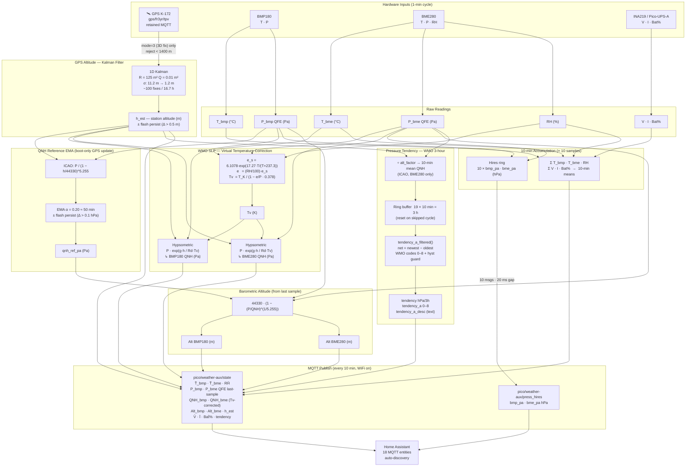

# Pico W Auxiliary Weather Station (BMP180 + BME280 + INA219)

The **first of a series of auxiliary Pico W sensors** that complement the main
[[Weather Station Project]] (Pimoroni Enviro Weather Pico W, MicroPython, wind/rain).

Built on a bare **Raspberry Pi Pico W** with three sensors: BMP180 (pressure/temp),
BME280 (pressure/temp/humidity), and INA219 via Pico-UPS-A (battery monitoring).
Samples at **1-minute intervals** and publishes to Home Assistant via MQTT every
**10 minutes**, following WMO observation standards. WiFi is only powered on the
10th sample cycle to extend battery life.

## Role in the wider system

```
┌─────────────────────────────────┐     ┌──────────────────────────────────┐
│  Main Station (MicroPython)     │     │  Aux Sensors (C/C++ Pico SDK)    │
│  Pimoroni Enviro Weather Pico W │     │  projects/pico-w-ha-sensor/       │
│  • Wind speed / direction       │     │    BMP180 + BME280 + INA219       │
│  • Rain gauge                   │     │  projects/<future>/  ──── ...     │
│  • Onboard temp/humidity/press  │     │                                   │
│  • Light sensor                 │     │  All share:                       │
└───────────────┬─────────────────┘     │  • Flash credential provisioning  │
                │ WiFi / MQTT           │  • MQTT → HA auto-discovery       │
                ▼                       │  • GPS altitude subscription      │
       ┌────────────────┐               └────────────────┬─────────────────┘
       │  MQTT Broker   │◀───────────────────────────────┘
       │  (fr3yr:1883)  │
       └────────┬───────┘
                ▼
       ┌────────────────┐
       │ Home Assistant │
       └────────────────┘
```

---

## Hardware

| Part | Notes |
|------|-------|
| Raspberry Pi Pico W | RP2040 + CYW43439 WiFi |
| BMP180 | I2C0, addr 0x77 — pressure + temperature (no humidity) |
| BME280 | I2C0, addr 0x76 (SDO → GND) — pressure + temperature + humidity |
| Waveshare Pico-UPS-A | INA219 on I2C1, addr 0x43 — battery current/voltage monitor |
| I2C0 | SDA → GP4, SCL → GP5, 200 kHz — shared by BMP180 + BME280 |
| I2C1 | SDA → GP6, SCL → GP7, 400 kHz — INA219 only |

---

## Firmware

**Repo:** `~/PICO/pico_nix` — project at `projects/pico-w-ha-sensor/`
**Build:** `just build-pico-w-ha-sensor` (root Justfile) or `just build` inside the project dir.
**Board:** `pico_w` — flash with picotool or drag-drop `.uf2`.

### Source layout

```
projects/pico-w-ha-sensor/
├── CMakeLists.txt        # pico_w board, links CYW43 + lwIP MQTT + hardware_flash
├── lwipopts.h            # lwIP config: LWIP_MQTT=1, threadsafe background mode
├── Justfile
├── package.nix           # Nix derivation (board = pico_w)
└── src/
    ├── main.c            # Boot flow + sensor loop
    ├── provisioning.h/c  # Flash credential storage + serial provisioning
    └── mqtt_ha.h/c       # lwIP MQTT client + HA auto-discovery

libs/
├── bmp180/               # BMP180 driver (I2C0)
├── bme280/               # BME280 driver (I2C0)
├── ina219/               # INA219 driver (I2C1)
├── i2c0/                 # I2C0 init (GP4/GP5, shared by BMP180 + BME280)
└── i2c1/                 # I2C1 init (GP6/GP7, INA219)
```

---

## Boot Flow

```
Power on
  │
  ▼
USB serial connected?  ──(wait)──▶ yes
  │
  ▼
Load credentials from flash
  │ magic == 0xC0FFEE01?
  ├── NO  ──▶ Serial provisioning (prompt SSID / pass / MQTT host / port)
  │            Write to flash → continue
  └── YES ──▶ continue
  │
  ▼
CYW43 init + WiFi connect (30 s timeout)
  │ failed? ──▶ creds_invalidate() + watchdog_reboot() → re-provisioning on next boot
  │
  ▼
I2C0 init → BMP180 init → BME280 init
I2C1 init → INA219 init
  │
  ▼
MQTT connect (DNS resolution + lwIP MQTT + 15 s timeout)
  │ failed? ──▶ creds_invalidate() + watchdog_reboot() → re-provisioning on next boot
  │
  ▼
Publish HA auto-discovery (retained, 12 entities)
Subscribe gps/fr3yr/tpv
Publish status "online" (retained)
  │
  ▼
1-min sample loop (every 60 s, no WiFi) ──────────────────────────────────────┐
  │                                                                            │
  ├─ rtc_deep_sleep(60 s) — PLL_SYS off, SRAM retained, USB alive            │
  ├─ Trigger BME280 forced-mode conversion (~40 ms)                           │
  ├─ BMP180 blocking read (~102 ms)                                           │
  ├─ Compute BMP180/BME280 QNH + altitude using s_station_alt (last GPS)     │
  ├─ INA219 read                                                              │
  ├─ Accumulate into sums; store press in s_hires[s_sample_count]            │
  ├─ s_sample_count++ → if < 10, continue (no WiFi)                          │
  └─ 10th sample → fall through to publish ────────────────────────────────────┘
                                │
                                ▼
10-min publish (every 10th cycle, WiFi on) ──────────────────────────────────┐
  │                                                                            │
  ├─ Compute 10-min averages (temp, humidity, battery)                        │
  ├─ Push 10-min mean MSL to tendency ring buffer                             │
  ├─ CYW43 init → WiFi connect (retry indefinitely)                           │
  ├─ MQTT connect (3 retries, then skip cycle)                                │
  ├─ Publish status "online" (retained)                                       │
  ├─ GPS fetch (one-shot retained message) → update s_station_alt + QNH EMA  │
  ├─ Recompute altitude with fresh QNH                                        │
  ├─ Burst-publish 10 × hires pressure readings (press_hires topic)          │
  ├─ Publish state JSON (averages + last pressure + tendency if 3h ready)     │
  ├─ CYW43 deinit                                                             │
  └─ Reset accumulators → loop ────────────────────────────────────────────────┘
```

---

## Credential Storage (Flash)

Last 4 KB sector of the 2 MB flash (`PICO_FLASH_SIZE_BYTES - FLASH_SECTOR_SIZE`).
Validated by magic word `0xC0FFEE01`.

```c
typedef struct {
    uint32_t magic;          // 0xC0FFEE01 when valid
    char     wifi_ssid[64];
    char     wifi_pass[64];
    char     mqtt_host[128]; // IP or hostname
    uint16_t mqtt_port;
    uint8_t  _pad[2];
} creds_t;
```

- Written with `flash_range_erase` + `flash_range_program` (interrupts disabled).
- `creds_invalidate()` erases the sector — next boot enters provisioning mode.
- Re-provisioning is triggered automatically on WiFi or MQTT connect failure.

---

## Measurements

### BMP180 (`libs/bmp180/`)

`bmp180_get_measurement()` takes `BMP_180_SS = 3` averaged samples at
oversampling mode `BMP_180_OSS = 1`. Returns:
- `T` — temperature in 0.1 °C units (divide by 10 for °C)
- `p` — absolute pressure in Pa (QFE)

Two compute-only functions (no I²C):

```c
bmp180_compute_sea_pressure(&sensor, station_alt_m);  // → p_relative (Pa, QNH)
bmp180_compute_altitude(&sensor, qnh_ref_pa);          // → altitude (m)
```

**Note on temperature accuracy:** BMP180 draws ~0.9 mA during measurement (older design),
causing die self-heating. It consistently reads ~1.7–1.9 °C *higher* than the BME280.
The BME280 is closer to actual ambient. BMP180 temperature exists primarily to compensate
its own pressure reading, not as a precision thermometer.

**Note on thermal lag:** The BMP180 responds to ambient temperature changes ~10 s
(one full cycle) slower than the BME280. This is a physical difference in thermal
mass between the two packages, not a code issue — both sensors are measured within
the same ~102 ms window each cycle. The BME280's smaller die equilibrates with
surrounding air faster; the BMP180's metal cap retains heat longer.

---

### BME280 (`libs/bme280/`)

#### Oversampling profile (Bosch "weather station" recommendation)

| Parameter | Setting | Value |
|-----------|---------|-------|
| `osrs_h` | 1 | ×1 humidity |
| `osrs_t` | 2 | ×2 temperature |
| `osrs_p` | 5 | ×16 pressure |
| Mode | forced | single-shot, returns to sleep (~0.1 µA) |
| Conversion time | ~40 ms | triggered at top of 10 s loop, read after sleep |

#### Non-blocking read pattern

BME280 forced-mode conversion (~40 ms) is triggered at the top of the loop, before
the BMP180 blocking read. The BMP180 takes ~102 ms, so by the time it finishes the
BME280 has been done for ~62 ms — no polling or sleep needed.

```c
// Top of loop: trigger BME280 (conversion takes ~40 ms)
bme_sensor.settings->mode = 0b01;
bme280_start_measurements(&bme_sensor);

// BMP180 blocking read (~102 ms: 3 × (10ms temp + 24ms press))
bmp180_get_measurement(&sensor);

// ... QNH / altitude computation (~0 ms) ...

// BME280 is already done — instant read, no wait
bme280_get_uncompensated_measurements(&bme_sensor);
bme280_compensate_temp(&bme_sensor);
bme280_compensate_press(&bme_sensor);
bme280_compensate_hum(&bme_sensor);

// ... INA219, publish ...

sleep_ms(10000);  // sleep is LAST, after publishing
```

**Note on BMP180 blocking time:** `bmp180_get_ut()` waits `BMP_180_TMP_TIME × 2 = 10 ms`
and `bmp180_get_up()` waits `pressure_time[OSS] × 3 = 24 ms` — both use conservative
multipliers over the datasheet minimums. With `BMP_180_SS = 3` averaged samples the
total blocking time is ~102 ms, not "a few ms" as older comments suggest.

#### Compensation output formats

| Quantity | Type | Units | Conversion |
|----------|------|-------|------------|
| Temperature | `int32_t T` | 0.01 °C | divide by 100 |
| Pressure | `uint32_t P` | Q24.8 Pa | divide by 256 → Pa |
| Humidity | `uint32_t H` | Q22.10 %RH | divide by 1024 |

Pressure Q24.8 means the value is Pa × 256. Valid range: 7680000–28160000
(corresponding to 300–1100 hPa × 256).

#### Sea pressure and altitude (computed inline in main.c)

```c
float bme_press_pa     = (float)bme_sensor.measure->P / 256.0f;
float bme_press_msl_pa = bme_press_pa / powf(1.0f - (station_alt / 44330.0f), 5.255f);
float bme_altitude_m   = 44330.0f * (1.0f - powf(bme_press_pa / mqtt.qnh_ref_pa, 1.0f / 5.255f));
```

Both sensors share the same `qnh_ref_pa` EMA (derived from GPS + BMP180 QNH).

#### Known driver bugs fixed

**osrs clobber (root cause of 691 hPa output):**
`bme280_set_config` called `bme280_read_ctrl_meas` to preserve the current mode bits
via read-modify-write. But `bme280_read_ctrl_meas` had the side effect of writing the
entire register back to the struct — including `osrs_p` and `osrs_t`. At init time the
chip is at power-on-reset (`0xF4 = 0x00`), so both fields were overwritten with 0
("skip measurement"). The chip then returned the sentinel `0x80000` for every pressure
reading, which the compensation formula turned into ~691 hPa garbage.
Fixed by reading only the mode bits directly without touching the struct's osrs fields.

**Pressure Q24.8 format mishandled:**
Original code divided by 256 × 100 (treating output as Pa × 100) then divided again,
producing ~270 hPa. Fixed by storing raw Q24.8 from the Bosch formula and dividing by
256 at display/publish time.

---

### QFE vs QNH

| Symbol | Meaning | Use |
|--------|---------|-----|
| QFE | Absolute station pressure (Pa) | Raw sensor output |
| QNH | Pressure normalised to sea level (Pa) | Weather comparison, aviation |

Formula: `QNH = QFE / (1 - alt_m / 44330)^5.255`

### ICAO and the International Standard Atmosphere

**ICAO** = *International Civil Aviation Organization* — the UN specialized agency
(Chicago Convention, 1944) that sets global civil aviation standards including
navigation, airspace rules, and altimetry. Headquartered in Montreal.

**Key references:**
- [ICAO Doc 7488 — Manual of the ICAO Standard Atmosphere (official store, paid)](https://store.icao.int/en/manual-of-the-icao-standard-atmosphere-extended-to-80-kilometres-262500-feet-doc-7488)
- [ICAO Doc 7488 3rd ed. 1993 — free PDF mirror (aviationchief.com)](http://www.aviationchief.com/uploads/9/2/0/9/92098238/icao_doc_7488_-_manual_of_icao_standard_atmosphere_-_3rd_edition_-_1994.pdf)
- [WMO-No. 8 CIMO Guide — meteorological SLP standard (already in `docs/standards/`)](https://library.wmo.int/records/item/41650-guide-to-instruments-and-methods-of-observation)

ICAO defines the **International Standard Atmosphere (ISA)**, a model of how
temperature, pressure, and density vary with altitude under standardized conditions:

| Parameter | ISA value at sea level | Lapse rate |
|-----------|----------------------|------------|
| Temperature | 15 °C (288.15 K) | −6.5 °C/km up to 11 km |
| Pressure | 1013.25 hPa | — |
| Density | 1.225 kg/m³ | — |

The ISA temperature at 1458 m works out to **≈ 5.5 °C** (15 − 6.5 × 1.458).

#### The ICAO simplified QNH formula

```
QNH = QFE / (1 − h / 44330)^5.255
```

This is derived from the hydrostatic equation + ISA temperature profile, collapsed
into a single power-law expression. It is **temperature-independent by design** —
a pilot can compute QNH from station pressure and altitude without knowing the
actual temperature. The tradeoff is that it implicitly assumes ISA temperature at
every altitude.

#### Why this matters at 1458 m

At sea level the ISA assumption is nearly harmless. At 1458 m the error compounds:

| Temperature assumption | At 1458 m | Effect on QNH |
|----------------------|-----------|--------------|
| ISA (ICAO formula) | 5.5 °C | baseline |
| Actual (your site, mean) | ~15 °C | **−3.7 hPa** |

The ~3.7 hPa difference is not sensor error — it is a known, systematic consequence
of using an aviation formula for synoptic meteorology at high elevation. The WMO
uses the **hypsometric formula with virtual temperature (Tv)** instead, which is
what this firmware publishes as QNH.

### Why GPS altitude → QNH is not circular

GPS altitude provides the station height to normalise QFE → QNH.
Using that same QNH to compute barometric altitude would just return GPS altitude —
circular and useless.

Instead, a **slowly-adapting EMA reference** (`qnh_ref_pa`) is maintained:

```
α = 0.20  →  ~5-reading window  →  ~50 s convergence at 10 s intervals
qnh_ref = α × QNH_new + (1-α) × qnh_ref
```

`qnh_ref` is then used to compute barometric altitude independently of the current GPS fix.

**Before first GPS fix:** initialised to standard atmosphere (101325 Pa), giving
"pressure altitude" — accurate to ±0–300 m depending on weather.

**After GPS calibration:** converges to the site's true QNH. Subsequent altitude
readings track *weather-driven pressure deviations* (~±30–100 m with fronts).

---

## MQTT

**Broker:** Mosquitto on `fr3yr`, port 1883, anonymous auth.

### Topics

| Topic | Direction | Retain | Content |
|-------|-----------|--------|---------|
| `pico/weather-aux/state` | Publish | No | JSON: 10-min averages + last pressure sample + tendency |
| `pico/weather-aux/press_hires` | Publish | No | JSON: 1-min pressure burst (10 messages per publish cycle) |
| `pico/weather-aux/status` | Publish | Yes | `"online"` (no LWT — see below) |
| `gps/fr3yr/tpv` | Subscribe (one-shot) | Yes | GPS JSON (extract `alt` field, once per publish cycle) |
| `homeassistant/sensor/<id>/config` | Publish | Yes | HA auto-discovery (17 entities) |

**No LWT configured.** An MQTT LWT fires on every clean TCP close when `cyw43_arch_deinit()`
tears down the link before the TCP FIN completes, causing spurious "offline" transitions
on every sleep cycle. Instead, each discovery config includes `expire_after: 630` (s) — HA
marks entities unavailable only if no state arrives within 630 s (~2 missed cycles).

### State payload (10-min publish, every 10 cycles)

```json
{
  "bmp180_temperature": 22.5,
  "bmp180_pressure": 843.25,
  "bmp180_pressure_msl": 1012.34,
  "bmp180_altitude": 1457.1,
  "bme280_temperature": 20.7,
  "bme280_pressure": 842.10,
  "bme280_pressure_msl": 1011.05,
  "bme280_altitude": 1459.3,
  "bme280_humidity": 38.4,
  "battery": 91,
  "voltage": 4.08,
  "current": -5.0,
  "tendency": -1.2
}
```

- Temperature and humidity: **10-min means** (WMO standard)
- Pressure / altitude: **most recent 1-min sample** (WMO: pressure is instantaneous)
- Battery/voltage/current: **10-min means** of INA219 samples
- `tendency`: **3-hour change in MSL pressure, hPa** — omitted until 3 h of data exist

### Hires pressure payload (1-min, burst on each publish)

```json
{"bmp_pa": 843.21, "bmp_msl_pa": 1012.10, "bme_pa": 843.08, "bme_msl_pa": 1011.97}
```

Ten of these are published in rapid succession (20 ms gaps) to `press_hires` on each
10-min connect. All values in **hPa**.

### HA auto-discovery entities (17 total)

All entities belong to device `pico_weather_aux` ("Pico W Aux Weather Station").

| Entity ID | Name | Device class | Unit | Topic |
|-----------|------|-------------|------|-------|
| `sensor.bmp180_temperature` | BMP180 Temperature | `temperature` | °C | state |
| `sensor.bmp180_pressure` | BMP180 Pressure (QFE) | `atmospheric_pressure` | hPa | state |
| `sensor.bmp180_pressure_msl` | BMP180 Pressure MSL (QNH) | `atmospheric_pressure` | hPa | state |
| `sensor.bmp180_altitude` | BMP180 Altitude | *(none)* | m | state |
| `sensor.bme280_temperature` | BME280 Temperature | `temperature` | °C | state |
| `sensor.bme280_pressure` | BME280 Pressure (QFE) | `atmospheric_pressure` | hPa | state |
| `sensor.bme280_pressure_msl` | BME280 Pressure MSL (QNH) | `atmospheric_pressure` | hPa | state |
| `sensor.bme280_altitude` | BME280 Altitude | *(none)* | m | state |
| `sensor.bme280_humidity` | BME280 Humidity | `humidity` | % | state |
| `sensor.pico_w_battery` | Battery | `battery` | % | state |
| `sensor.pico_w_voltage` | Battery Voltage | `voltage` | V | state |
| `sensor.pico_w_current` | Battery Current | `current` | mA | state |
| `sensor.bmp180_press_hires` | BMP180 Pressure hires (QFE) | `atmospheric_pressure` | hPa | press_hires |
| `sensor.bmp180_press_msl_hires` | BMP180 Pressure MSL hires (QNH) | `atmospheric_pressure` | hPa | press_hires |
| `sensor.bme280_press_hires` | BME280 Pressure hires (QFE) | `atmospheric_pressure` | hPa | press_hires |
| `sensor.bme280_press_msl_hires` | BME280 Pressure MSL hires (QNH) | `atmospheric_pressure` | hPa | press_hires |
| `sensor.bmp180_tendency` | BMP180 Pressure Tendency (3h) | *(none)* | hPa/3h | state |

### GPS altitude fetch

`gps/fr3yr/tpv` is the retained topic published by the gpsd bridge on `fr3yr`
(see `NIX_REPO/nix/services/gpsd.nix`). Payload format:

```json
{"lat": -25.755, "lon": 28.232, "alt": 1457.8, "speed": 0.1, "mode": 3, "nSat": 12, "uSat": 8}
```

The `alt` field is extracted with a simple `strstr` search — no JSON library.
GPS is fetched **once per 10-min publish cycle** (one-shot subscribe → 3 s wait → unsubscribe
on the retained message). `s_station_alt` (static, survives deep sleep) caches the last
known GPS altitude and is used for MSL pressure computation during the intervening 9
sleep cycles.

---

## lwIP / CYW43 Threading Notes

The CYW43 driver runs in **threadsafe background** mode: the WiFi interrupt drives
lwIP from IRQ context. Any lwIP API call from the main thread must be wrapped:

```c
cyw43_arch_lwip_begin();
mqtt_publish(...);
cyw43_arch_lwip_end();
```

The MQTT callbacks (`connection_cb`, `inpub_request_cb`, `inpub_data_cb`) fire from
IRQ context where the lock is already held — do not call `lwip_begin` inside them.

Shared state between IRQ and main (`gps_altitude_m`, `gps_alt_valid`) is read inside
`cyw43_arch_lwip_begin/end`. `qnh_ref_pa` is only touched by main context so no
locking is needed.

---

## Home Assistant

**Config file:** `NIX_REPO/nix/services/home-assistant.nix`
**Lovelace view:** "Weather Station" (`/weather-station`)

Cards:
1. Entities — BMP180 current readings (T, QFE, QNH, altitude)
2. Entities — BME280 current readings (T, QFE, QNH, altitude, humidity)
3. Entities — Pico UPS-A battery (%, voltage, current)
4. History graph — Temperature & Humidity 24 h (BMP180 + BME280 temp, BME280 humidity)
5. History graph — Pressure 24 h (BMP180 + BME280 QFE and QNH)
6. History graph — Altitude 24 h (BMP180 + BME280)
7. History graph — Battery 24 h (% and voltage)

Lovelace is fully declarative (`lovelaceConfigWritable = false`), managed by Nix.
Deploy with `nixos-rebuild switch` on `fr3yr`.

---

## Waveshare Pico-UPS-A Battery Monitor

**Hardware (from schematic `docs/datasheets/pico-ups-a-schematic.pdf`):**

| Detail | Value |
|--------|-------|
| IC | INA219 (TI current/power monitor) |
| I2C bus | I2C1 — GP6 (SDA), GP7 (SCL) |
| I2C address | 0x43 (A0 = VS, A1 = GND — confirmed in hardware) |
| Shunt resistor | 10 mΩ (R1, 1%, 2512) |
| Charger IC | ETA6003 |
| Protection | S8261 + FS8205 |

**Driver:** `libs/ina219/`

**Calibration (Cal = 4096):**
- Current_LSB = 0.04096 / (4096 × 0.01 Ω) = **1 mA / LSB**
- Power_LSB = 20 × 1 mA = **20 mW / LSB**

**Battery % from voltage:** piecewise-linear curve calibrated against a measured discharge
of this specific battery (`libs/ina219/src/ina219.c`, `lipo_curve[]`).

**Calibration source:** HA history export (`~/Downloads/history.csv`), 2026-05-09 15:43 →
2026-05-10 04:46 — 13.05 h discharge from 4.06 V to 3.09 V under ~21 mA load (old firmware,
always-on WiFi). Battery: Pico-UPS-A 800 mAh LiPo.

This battery has a notably **flat mid-plateau** (3.83–4.03 V spans 40%–90%) compared to a
generic LiPo curve. The generic curve (`3.75 V = 55%`) significantly overestimated remaining
capacity in the 3.65–3.85 V range; measured data shows `3.75 V ≈ 25%`.

| Voltage | % remaining | Notes |
|---------|-------------|-------|
| 4.20 V | 100% | ETA6003 charger target |
| 4.06 V |  97% | Settled post-charge; little capacity above this |
| 4.03 V |  90% | Measured |
| 3.99 V |  80% | Measured |
| 3.93 V |  70% | Measured |
| 3.87 V |  55% | Start of very flat mid-plateau |
| 3.83 V |  40% | End of very flat plateau |
| 3.75 V |  25% | Measured (generic curve said 55% — was badly wrong) |
| 3.60 V |  10% | Measured |
| 3.45 V |   5% | Measured |
| 3.00 V |   0% | Protection cutoff |

#### INA219 sampling — 10-min mean of pre-WiFi active-phase readings

The INA219 is read once per 1-minute cycle, immediately after the sensor reads (BMP180 +
BME280) and **before** WiFi is brought up. The 10-sample mean is published every 10 minutes.

**What each sample captures:**
RP2040 running at 125 MHz, I2C buses active, BMP180/BME280 just completed — CYW43 still
off. This is the brief active-no-WiFi window (~300 ms per cycle). On cycle 10, WiFi comes
up *after* the INA219 read, so the CYW43 TX current is not captured in any sample.

This is a significant improvement over the previous firmware where a single reading was
taken during WiFi TX. The published mean is now consistent and reproducible: it represents
"active-phase current without radio" averaged over 10 samples.

**What the mean does not represent:**
- **Deep sleep current** (~1–2 mA): the RP2040 cannot drive I2C with PLL_SYS off — deep
  sleep occupies ~59.7 s of each 60 s cycle but contributes nothing to the INA219 average.
- **WiFi TX current** (~50 mA for ~15–20 s on cycle 10 only): occurs after the INA219 read.

The published voltage and battery % are similarly pre-WiFi snapshots. Voltage readings are
therefore slightly optimistic compared to under-WiFi-load values.

**Estimated true average current draw (new architecture):**

| Phase | Per 10-min window | Approx current | Contribution |
|-------|-------------------|----------------|--------------|
| Deep sleep (cycles 1–10) | 10 × ~59.7 s = 597 s | ~1.5 mA | ~895 mA·s |
| Active no-WiFi (cycles 1–10) | 10 × ~0.3 s = 3 s | ~28 mA | ~84 mA·s |
| WiFi active (cycle 10 only) | ~17 s | ~50 mA | ~850 mA·s |
| **Total / average** | **600 s** | | **~3.0 mA** |

At 800 mAh → estimated runtime ~**11 days** (previously ~12–15 hours at ~21 mA with the
old always-on WiFi + `sleep_ms()` loop).

To measure the true average directly, a coulomb counter (e.g. LTC4150) or a low-value
shunt with continuous logging would be needed.

---

## Sampling Strategy (WMO-aligned)

The firmware implements a **1-minute sampling / 10-minute publish** cycle aligned with
WMO observational standards, rather than the simpler "measure and publish every N minutes"
approach used in earlier firmware iterations.

### Standards basis

#### WMO-No. 8 — Guide to Instruments and Methods of Observation (CIMO Guide)
*WMO, 2018 edition (updated 2021). Available: [https://library.wmo.int/records/item/41650-guide-to-instruments-and-methods-of-observation](https://library.wmo.int/records/item/41650-guide-to-instruments-and-methods-of-observation)*

The CIMO Guide defines standard averaging and reporting periods for surface
meteorological observations:

- **Pressure** (§I/3.2): recorded as an instantaneous value (no averaging).
  Atmospheric pressure changes slowly enough that a single accurate reading is
  representative. The standard observation is taken at or near the top of the hour
  (synoptic time).

- **Temperature** (§I/2.1): the recommended observation is the mean over the preceding
  **10 minutes**, derived from 1-minute samples. This reduces the influence of turbulent
  fluctuations and short-lived anomalies. WMO describes the 10-minute mean as the
  standard for synoptic surface temperature.

- **Relative humidity** (§I/4.1): follows the same convention as temperature — the
  reported value is the mean over the preceding **10 minutes**. Humidity fluctuates
  more rapidly than temperature in some conditions (e.g., near vegetation), making
  averaging equally important.

#### WMO-No. 306 — Manual on Codes, Vol I.1 (SYNOP)
*WMO, 2019 edition. Available: [https://library.wmo.int/records/item/35713-manual-on-codes-international-codes-volume-i-1](https://library.wmo.int/records/item/35713-manual-on-codes-international-codes-volume-i-1)*

The SYNOP message format (used by national meteorological services worldwide) includes
the **pressure tendency group** `3appp`:

- `a` — characteristic of pressure change (rising, falling, steady, etc.)
- `ppp` — amount of change in the **3 hours** preceding the observation, in tenths of hPa

The **3-hour window** is the WMO-mandated period for pressure tendency. This element is
one of the most diagnostically useful parameters in SYNOP, indicating the approach of
fronts and pressure systems. A rapid fall of 3–6 hPa/3h indicates an approaching low;
a rise of similar magnitude indicates a high or frontal passage.

### Implementation decisions

| Parameter | Sampling | Reporting | Rationale |
|-----------|----------|-----------|-----------|
| Pressure (QFE / QNH) | 1 min instantaneous | Most recent 1-min sample | WMO: instantaneous; also burst-published (see below) |
| Temperature | 1 min | 10-min mean of 10 samples | WMO CIMO Guide §I/2.1 |
| Relative humidity | 1 min | 10-min mean of 10 samples | WMO CIMO Guide §I/4.1 |
| Pressure tendency | 10-min mean per window | 3-hour change (19 windows) | WMO SYNOP `3appp` element |
| Battery / power | 1 min | 10-min mean of available samples | Same cycle as temperature |

**Sampling interval**: `MEASURE_INTERVAL_MS = 60 000 ms` (1 min)
**Publish interval**: every `SAMPLES_PER_PUBLISH = 10` samples (10 min)
**WiFi active**: only on the 10th cycle — ~10% duty cycle → significantly extends battery life

### Pressure tendency implementation

A ring buffer of `TENDENCY_HISTORY = 19` entries stores the 10-minute mean MSL pressure
(hPa) from each publish cycle. 19 entries × 10 min = **180 min = 3 hours**.

```
Newest entry: s_tend_buf[(s_tend_write - 1 + 19) % 19]
Oldest entry: s_tend_buf[s_tend_write]          ← about to be overwritten
Tendency     = newest − oldest  (hPa over 3 h)
```

The tendency JSON key is **omitted** from the state payload until the buffer is full
(`s_tend_count == 19`, i.e., 3 hours after boot). HA's value template
`{{ value_json.tendency | default(None) }}` returns `None` → entity shows **Unknown**
until enough data is accumulated. This is correct and avoids publishing meaningless
early values.

If a publish cycle is skipped (WiFi or MQTT failure), the tendency ring buffer is reset
(`s_tend_count = 0`) to prevent a time-gap corrupting the 3-hour window.

### High-resolution pressure (hires topic)

To preserve 1-minute resolution in HA history graphs while only connecting to WiFi every
10 minutes, all 10 pressure readings are **burst-published** to a separate topic
(`pico/weather-aux/press_hires`) with 20 ms gaps when WiFi is available.

**Limitation**: HA records all 10 readings with the *publish* timestamp, not the
*measurement* timestamp. The history graph shows 10 data points clustered at the
10-minute mark rather than evenly spaced at 1-minute intervals. This is a fundamental
constraint of the architecture (no persistent storage of timestamps on-device) and is
acceptable for the application.

Each reading is published as a separate non-retained JSON message:
```json
{"bmp_pa": 843.21, "bmp_msl_pa": 1012.10, "bme_pa": 843.08, "bme_msl_pa": 1011.97}
```

Four HA entities are registered on this topic:
`sensor.bmp180_press_hires`, `sensor.bmp180_press_msl_hires`,
`sensor.bme280_press_hires`, `sensor.bme280_press_msl_hires`.

---

## Planned Hardware Upgrades

### BMP581 — replaces BMP180 (preferred over BMP388 — buy this instead)

**Recommendation: skip BMP388, go straight to BMP581.** It is available now at
[SEN0667 — DFRobot Fermion BMP581 breakout](https://www.robotics.org.za/SEN0667).
BMP581 is Bosch's latest generation using a new **capacitive MEMS** architecture
(all previous Bosch pressure sensors use piezoresistive). The capacitive approach
is fundamentally less sensitive to mechanical stress and package deformation.

| Spec | BMP180 | BMP388 | **BMP581** |
|------|--------|--------|-----------|
| Absolute accuracy | ±1.0 hPa | ±0.5 hPa | **±0.3 hPa** |
| Relative accuracy | — | ±0.08 hPa | **±0.06 hPa** |
| Noise RMS | ~0.6 Pa | ~0.9 Pa | **0.08 Pa** (~11× lower) |
| Long-term drift | unknown | unknown | **±0.1 hPa / 12 months** |
| TCO | high | moderate | **±0.5 Pa/K** |
| ADC | 8-bit oversampled | 24-bit | 24-bit |
| Built-in IIR filter | No | Yes (order 0–127) | Yes |
| FIFO buffer | No | Yes (512 samples) | Yes |
| Interface | I2C only | I2C + SPI | **I2C + SPI + I3C** |
| Power @ 1 Hz | ~0.9 mA active | ~3.4 µA | **1.3 µA** |
| Standby current | — | — | **0.5 µA** |
| Package | TO-5 can | 2.0×2.0×0.75 mm | 2.0×2.0×0.75 mm |

**Why the 11× noise improvement matters at this elevation:**
At 858 hPa station pressure, BMP388 noise of ~0.9 Pa translates to ~±0.075 m
altitude noise per reading. BMP581 at 0.08 Pa gives ~±0.007 m — below any
meteorological relevance. The tendency ring buffer benefits most: 10-min means
are already smoothed, but single noisy samples from BMP388 can still contaminate
the midpoint of the 3-hour window and flip the WMO `a` code.

BMP581 becomes the **primary pressure source** for QNH and the tendency ring
buffer. BME280 demoted to secondary pressure + authoritative humidity.

**References:**
- [BMP581 datasheet (Bosch, PDF)](https://www.bosch-sensortec.com/media/boschsensortec/downloads/datasheets/bst-bmp581-ds004.pdf) — also at `docs/datasheets/bmp581-datasheet.pdf` via `just fetch-datasheets`
- [BMP5 Sensor API (Bosch, GitHub)](https://github.com/boschsensortec/BMP5-Sensor-API) — open-source C driver, replaces `libs/bmp180/`
- [DFRobot SEN0667 wiki](https://wiki.dfrobot.com/SKU_SEN0667_Fermion:_BMP581_Barometric_Pressure_Sensor)
- [Product page (robotics.org.za)](https://www.robotics.org.za/SEN0667)

I2C address: 0x46 or 0x47 (SDO pin selects) — no conflict with BME280 (0x76/0x77).

### TMP117 — add as primary temperature sensor (owned)

Texas Instruments TMP117: I2C, ±0.1°C accuracy (max, −20 to +50°C), 0.0078°C resolution, 45 µW self-heating (negligible).

**This is the correct home for the TMP117.** Reasons:

1. **WMO Class 1 compliance** — WMO requires ±0.2°C for Class 1 surface temperature. TMP117 at ±0.1°C is the only sensor in this stack that meets it. BMP388 temperature is ±0.5°C; BME280 is ±1°C typical with die self-heating.
2. **Public data contribution quality** — Weather Underground, SAWS, and WMO data networks expect properly measured temperature. TMP117 + radiation shield (Stevenson screen) gives a credible outdoor temperature reference. See [[Public Data Contribution Plan]].
3. **QNH cross-check** — the hypsometric QNH formula depends on accurate temperature. A more accurate temperature input produces a more accurate MSL normalisation.

I2C address: 0x48–0x4B (4 options via ADD0 pin — no conflict with BMP388 or BME280).

On the air-sensor, the SHT40 (±0.2°C) already provides adequate temperature for SGP41 compensation — TMP117 adds more value here on the outdoor station.

### BME680 — fully replaces BME280

BME680 provides identical temperature/humidity/pressure channels to BME280 plus a raw MOX gas resistance channel. Since it fully replaces BME280, there is no address conflict — one sensor at 0x76, BMP388 at 0x77.

Temperature from BME680 is unreliable due to MOX heater self-heating (2–5°C above ambient). TMP117 is the authoritative temperature source. BME680 temperature is used only to compensate its own pressure reading internally.

The gas resistance channel (raw Ohms) gives a broad-band outdoor air quality indicator — not specific to any gas, but interesting to log over time. Lower resistance = more reducing gases (VOCs, CO, H2). Outdoor drift is high; treat as a curiosity/trend channel rather than a calibrated measurement. Without BSEC no IAQ score is available — raw resistance only.

### SHT45 — WMO-grade humidity (recommended addition)

WMO-No. 8 §4.2.3 specifies ±2% RH for Class 1 surface humidity. The BME680 provides ±3% RH — below Class 1. Options ranked by accuracy:

| Sensor | RH accuracy | Temp | Notes |
|--------|------------|------|-------|
| **HDC3022** (TI) | **±0.5% RH** | ±0.1°C | Best available; PTFE filter membrane; same TI family as TMP117; harder to source |
| **SHT45** (Sensirion) | **±1.0% RH** | ±0.1°C | Recommended — Sensirion flagship, widely available, comfortably meets WMO Class 1 |
| **SHT85** (Sensirion) | ±1.5% RH | ±0.1°C | Built-in PTFE membrane for outdoor/contamination protection |
| BME680 (existing) | ±3% RH | unreliable | Below Class 1; adequate as secondary only |

**Recommendation: SHT45.** Pair with TMP117 — both provide ±0.1°C temperature (use TMP117 as authoritative temp, SHT45 as authoritative humidity). Together they give a WMO Class 1 T/RH measurement pair, strengthening the data contribution case. See [[Public Data Contribution Plan]].

The SHT85 adds a PTFE filter membrane which is beneficial outdoors (blocks liquid water and dust while allowing air exchange). Worth considering if mounting in a non-Stevenson-screen enclosure.

I2C: SHT45 uses 0x44 or 0x45 — no conflict with existing sensors.

### AS3935 Lightning Sensor — add (owned as MA5532 module)

Detects RF signatures of lightning return strokes up to 40 km. Outputs:
- Lightning event interrupt (configurable threshold)
- Estimated distance to storm front (1–40 km in 9 bins)
- Relative energy per strike
- Disturber rejection (filters man-made RF noise — motors, switch-mode PSUs)

Natural complement to pressure tendency: storm approach visible in both channels simultaneously. Distance + direction of pressure fall tells the full frontal passage story.

**Implementation gotchas:**
- Antenna resonance must be tuned to 500 kHz on first boot — chip provides a calibration routine; store result in flash
- Sensitive to switching noise — add ferrite bead on VCC, keep away from PSU traces
- Building RF shielding limits indoor range; mount sensor at or near an exterior wall
- SPI preferred over I2C for noise immunity in electrically noisy environments
- Interrupt-driven — connect IRQ pin to a Pico GPIO with edge-detect interrupt

### DS3231 RTC + Dormant-Mode Sleep

**Module:** [Waveshare Pico-RTC-DS3231 (W19426)](https://www.robotics.org.za/W19426) —
a DS3231 breakout designed to stack on the Pico. DS3231 accuracy: ±2 ppm
(≈ ±0.17 s/day, ±1 min/year), battery-backed, I2C.

**References:**
- [DS3231 datasheet (Analog Devices, PDF)](https://www.analog.com/media/en/technical-documentation/data-sheets/ds3231.pdf) — also at `docs/datasheets/ds3231-datasheet.pdf` via `just fetch-datasheets`
- [Waveshare Pico-RTC-DS3231 wiki](https://www.waveshare.com/wiki/Pico-RTC-DS3231)
- [RPi Forums: DS3231 dormant wakeup example](https://github.com/ghubcoder/PicoSleepRtc)

#### Goal: DS3231 alarm wakes Pico from dormant mode (SRAM retained)

```
DS3231 alarm fires → INT pin goes low → Pico GPIO edge → wake from dormant
```

No MOSFET, no hard power-off. SRAM is retained — no architecture changes to
accumulators or ring buffers needed.

#### Why dormant mode, not the current PLL_SYS-stop sleep?

The RP2040 has two software sleep states:

| Mode | Clocks stopped | Wake source | Sleep current | SRAM |
|------|---------------|-------------|---------------|------|
| Current (PLL_SYS stop) | PLL_SYS only | Internal RTC alarm (XOSC still on) | ~1.5 mA | Retained |
| **Dormant (target)** | **All clocks incl. XOSC** | **GPIO edge (DS3231 INT)** | **~0.1–0.3 mA** | Retained |

Dormant mode stops XOSC which is why an external interrupt source is needed —
the internal RTC cannot fire without XOSC running. The DS3231 fills this role.

**Battery life estimate:**

| Phase | Current | Duration / 10-min window | mA·s |
|-------|---------|--------------------------|------|
| Sleep (current, PLL_SYS stop) | ~1.5 mA | 597 s | ~896 |
| Sleep (dormant target) | ~0.2 mA | 597 s | ~120 |
| Active + WiFi (unchanged) | ~30–50 mA | ~20 s | ~700 |
| **Total (current)** | | 617 s | ~1596 → ~**11 days** |
| **Total (dormant target)** | | 617 s | ~820 → ~**22 days** |

#### Implementation with `pico_sleep`

`pico_sleep` (requires TinyUSB submodules — present in the project's Nix build via
`pkgs.pico-sdk.override { withSubmodules = true; }`) exposes dormant mode directly:

```c
#include "pico/sleep.h"

// Before sleeping:
sleep_run_from_xosc();                            // switch clocks to XOSC
sleep_goto_dormant_until_pin(INT_PIN, true, false); // wake on DS3231 INT low edge

// After wake — restore 125 MHz and re-init peripherals:
set_sys_clock_khz(125000, true);
global_i2c_init();
// clear DS3231 alarm flag via I2C before next sleep
```

The DS3231 INT pin must be connected to a Pico GPIO. On wake, the DS3231 alarm
flag must be cleared (I2C write) before re-arming; otherwise INT stays low and
the next `sleep_goto_dormant_until_pin` returns immediately.

The existing `rtc_deep_sleep()` function (which manually drives `scb_hw->scr` and
`clocks_hw` registers as a workaround) can be replaced entirely.

#### Benefits beyond power savings

- **Accurate wall-clock time**: DS3231 keeps time across power cycles. The current
  firmware resets the internal RTC to 2020-01-01 on every cycle just to count 60 s —
  a workaround that goes away entirely.
- **Measurement timestamps**: each 1-min hires pressure reading can carry a real
  ISO 8601 timestamp in the MQTT payload, fixing the "10 readings arrive at the same
  HA timestamp" problem in the history graph.
- **Longer sleep intervals**: can sleep precisely until :00 of each minute (wall-clock
  aligned) rather than ~60 s from an arbitrary boot time.

#### Firmware changes required

1. Add DS3231 driver (`libs/ds3231/`) — I2C, set alarm, read time, clear INT flag
2. Wire DS3231 INT → a spare GPIO (e.g. GP15); configure as edge-triggered interrupt
3. Replace `rtc_deep_sleep()` with `ds3231_dormant_sleep()`:
   - Set DS3231 Alarm 2 for T+1 min
   - Configure GPIO wakeup
   - Stop XOSC + enter dormant
   - On wake: clear alarm flag, restart clocks, re-init I2C
4. Optionally include DS3231 timestamp in hires MQTT payload

I2C address: DS3231 = 0x68 — no conflict with BMP180 (0x77), BME280 (0x76),
INA219 (0x43 on I2C1). Can share I2C0 or I2C1.

### Planned architecture after upgrades

```
I2C bus (shared, GP4/GP5):
  BMP581  0x47  Primary pressure (replaces BMP180) — SDO → VDDIO
  BME680  0x76  Secondary pressure + gas resistance (replaces BME280) — SDO → GND
  TMP117  0x48  Primary temperature (WMO Class 1, ±0.1°C)
  SHT45   0x44  Primary humidity (WMO Class 1, ±1.0% RH) + secondary temperature
  DS3231  0x68  RTC (battery-backed, alarm wakeup) — stacks via Waveshare module

AS3935:
  SPI (preferred) or I2C 0x03  Lightning distance + energy (IRQ → Pico GPIO)
```

Role reassignment after upgrades:

| Measurement | Source (current) | Source (after) |
|-------------|-----------------|----------------|
| Primary pressure / QNH / tendency | BME280 | BMP581 |
| Primary temperature (WMO Class 1) | BME280 | TMP117 ±0.1°C |
| Primary humidity (WMO Class 1) | BME280 | SHT45 ±1.0% RH |
| Secondary pressure | BMP180 | BME680 |
| Gas resistance (curiosity) | — | BME680 |
| Lightning | — | AS3935 |
| Timekeeping / wakeup / timestamps | internal RTC (no battery) | DS3231 (battery-backed) |

---

## TODO — Future Software Work

### Flash wear levelling *(low priority — current design is safe)*

`params_save()` always erases and re-programs the same 4 KB sector (last sector of
2 MB flash). NOR flash endurance: **100 000 erase cycles per sector**.

| Scenario | Writes/day | Days to limit |
|----------|-----------|---------------|
| Every GPS fetch, no guard | 144 | ~694 |
| With change-detection guard (current) | ~0 at convergence | **Not a concern** |

The change-detection guard (write only if Δalt > 0.5 m or ΔQNH > 0.1 hPa) means
writes drop to near-zero after Kalman convergence (~16 h). No urgency.

Because the RTC plan uses **software dormant sleep with SRAM retained**, accumulators
and ring buffers never need to go to flash — so the write rate does not increase.
Implement proper wear levelling if the sensor runs continuously for > 2 years, or
if a hard power-off architecture is reconsidered later.

### Sensor bias correction *(deferred — needs reference or third sensor)*

Observed inter-sensor offsets (from `~/WEATHER_DATA/` CSV analysis):

| Quantity | BMP180 vs BME280 | Direction |
|----------|-----------------|-----------|
| Temperature | +1.198 °C | BMP180 reads warmer (self-heating) |
| Pressure | −1.008 hPa | BMP180 reads lower |

Both are consistent (σ < 0.1 for each), but **source is unknown** — either sensor
could be closer to truth. Options:

- Wait for BMP581 (third independent pressure reading) → cross-calibrate all three.
  The sensor closest to the median of three is most likely correct.
- Compare QNH against nearby SAWS synoptic station during stable high-pressure days
  (morning, no convection) → absolute reference.

Until then, both sensors publish their raw (uncorrected) values.

### Variance-weighted sensor fusion *(deferred — needs bias correction first)*

Once systematic biases are characterised, combine BMP180 (or BMP581 replacement)
and BME280 pressure readings into a single minimum-variance estimate:

```
P_fused = (P1/σ1² + P2/σ2²) / (1/σ1² + 1/σ2²)
```

Requires knowing individual measurement variances σ1², σ2² (not just inter-sensor
difference). BMP581 datasheet gives noise specs; BME280 can be characterised from
high-resolution still-air data.

At that point, the fused pressure would replace both individual readings as the
input to the tendency ring buffer and QNH calculation, while individual sensor
readings are still published for diagnostics.

---

## Measurement & Processing Pipeline

End-to-end flow from raw sensor reads to Home Assistant entities.



### Key design choices summarised

| Stage | Choice | Why |
|-------|--------|-----|
| GPS Kalman | Stationary 1D, R=125 m², Q=0.01 m² | GPS σ≈11 m; converges to σ≈1.2 m. BME280 altitude excluded — it tracks weather, not real position. |
| QNH formula | WMO hypsometric + virtual temperature Tv | At 1458 m, actual T is +9.6°C above ISA → ~3.7 hPa difference from ICAO simplified. Tv accounts for real T and humidity. |
| Humidity in VT | Used directly, no smoothing | σ=1.4% RH → ±0.05 hPa variance on QNH correction. Smoothing would further reduce an already negligible error. |
| QNH EMA feedstock | ICAO formula (boot-only, from BMP180) | Consistent with barometric altitude formula; QNH EMA is a *reference*, not a reporting value. |
| Tendency ring | ICAO MSL, BME280 only | Tendency measures *change* — ICAO vs Tv differs by a near-constant ~3.7 hPa which cancels in the subtraction. |
| No sensor fusion | BMP180 and BME280 reported independently | Known biases: BMP180 T +1.2°C warmer, BMP180 P −1.0 hPa lower. Source unknown (both could be "wrong"). Fusion deferred until BMP388 replaces BMP180. |
| Flash wear guard | Write only if Δalt > 0.5 m or ΔQNH > 0.1 hPa | At convergence Kalman drifts <0.1 m/update → near-zero flash writes. 100k-cycle sector limit not a concern at steady state. |

---

## Related Notes

- [[Weather Station Project]] — full project with wind/rain sensors
- [[GPS - DFRobot TEL0137 Setup & Troubleshooting]] — GPS module that provides altitude
