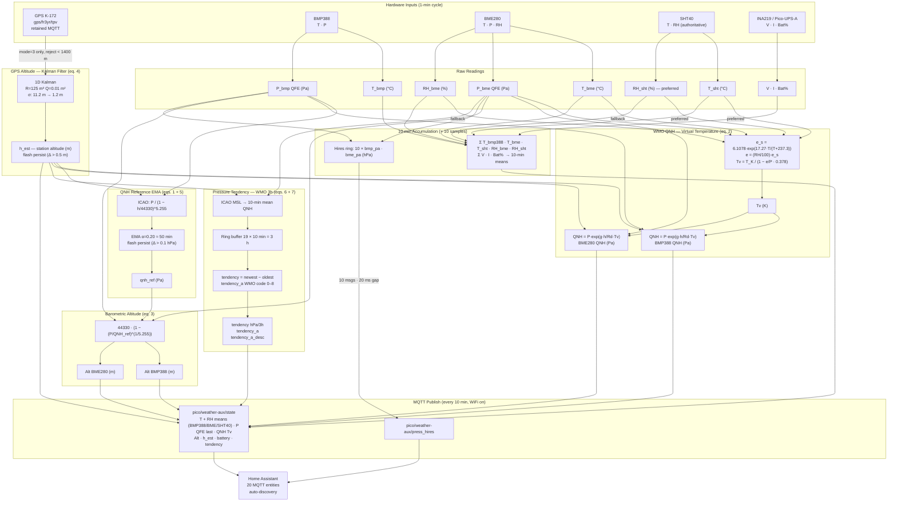

# Weather Station — Full System

A single bare **Raspberry Pi Pico W** (C/C++, Pico SDK) station that handles the
full outdoor weather measurement pipeline: weather meter kit (wind speed, wind
direction, rainfall) connected via **RJ11 breakouts**, environmental sensors
(pressure, temperature, humidity), GPS altitude normalisation, battery monitoring,
and MQTT → Home Assistant integration.

This note combines the former *Weather Station Project* (wind/rain hardware plan)
and *Pico W Auxiliary Weather Station* (env-sensor firmware) into one master
reference document.

---

## Goals

- [x] Publish pressure, temperature, humidity via MQTT → HA auto-discovery
- [x] GPS-calibrated QNH (sea-level pressure normalisation)
- [x] WMO-aligned 10-min averaging + 3-hour pressure tendency (WMO SYNOP `3appp`)
- [x] Battery monitoring (INA219 / Pico-UPS-A)
- [x] SHT40 + TMP117 purchased (WMO-grade T/RH) ✅ 2026-05-23
- [x] RJ11 breakouts purchased ✅ 2026-05-23
- [x] SHT40 driver implemented + wired into pico-w-env-sensor ✅ 2026-05-23
- [x] BMP388 driver implemented; replaces BMP180 in pico-w-env-sensor ✅ 2026-05-23
- [ ] Integrate TMP117 into firmware
- [ ] Wind speed, wind direction, rainfall — SparkFun SEN-15901 via RJ11 breakouts
- [ ] Replace BME280 with BMP581 (sole pressure source once BMP581 sourced)
- [ ] Add ENS160 for dedicated VOC / air quality
- [ ] Deep-sleep upgrade: DS3231 dormant wakeup (doubles battery life)
- [ ] Deploy weatherproof outdoor installation
- [ ] Contribute data publicly — see [[Public Data Contribution Plan]]

---

## System Architecture

```
┌──────────────────────────────────────────────────┐
│  SparkFun SEN-15901 Weather Meter Kit             │
│  ├─ Anemometer   (RJ11 → GP breakout, reed)       │
│  ├─ Rain gauge   (RJ11 → GP breakout, reed)       │
│  └─ Wind vane    (RJ11 → GP breakout, ADC)        │
└───────────────────┬──────────────────────────────┘
                    │ RJ11 breakouts (DIY wiring)
┌───────────────────▼──────────────────────────────┐
│  Raspberry Pi Pico W                              │
│  I2C0  BMP388 + BME280 + SHT40 (current)           │
│        BMP581 + TMP117 + ENS160 (planned)          │
│  I2C0  DS3231 RTC (planned)                      │
│  I2C1  INA219 / Pico-UPS-A                       │
│  SPI   AS3935 lightning (planned)                │
│  UART0 (reserved / debug)                        │
└───────────────────┬──────────────────────────────┘
                    │ WiFi / MQTT (every 10 min)
                    ▼
          ┌──────────────────┐
          │   MQTT Broker    │◀── gps/fr3yr/tpv (GPS altitude)
          │  (fr3yr : 1883)  │
          └────────┬─────────┘
                   ▼
          ┌──────────────────┐
          │  Home Assistant  │
          │  • Weather data  │
          │  • Battery alert │
          └──────────────────┘
```

---

## Hardware

### Weather Meter Kit — SparkFun SEN-15901

| Sensor | Connection | Signal | Notes |
|--------|-----------|--------|-------|
| Anemometer | RJ11 breakout → Pico GPIO (pull-up) | Reed switch (2-wire) | 1 closure = 2.4 km/h wind speed |
| Rain gauge | RJ11 breakout → Pico GPIO (pull-up) | Reed switch (2-wire) | 1 tip = 0.2794 mm rainfall |
| Wind vane | RJ11 breakout → 3.3 V + Pico ADC | Resistor ladder (4-wire) | Voltage → 16 compass directions |

The Pimoroni Enviro Weather board is **not** used. All SEN-15901 connections are
made directly from the RJ11 breakout pins to the Pico W GPIOs and ADC input.

- **Anemometer / Rain gauge**: the reed switch closes to GND; use Pico internal
  pull-up and edge-triggered GPIO interrupts to count closures.
- **Wind vane**: requires a 10 kΩ pull-up to 3.3 V on the signal wire; connect
  signal to an ADC-capable pin. The vane contains a resistor ladder with values
  per direction defined in the [SparkFun hookup guide](https://learn.sparkfun.com/tutorials/weather-meter-hookup-guide).

### Environmental Sensors

| Part | I2C addr | Interface | Measures | Status |
|------|----------|-----------|----------|--------|
| BMP388 | 0x77 (SDO→VDDIO) | I2C0 GP4/GP5 | Pressure + temperature | **Current** — replaces BMP180; driver in `libs/bmp388/` |
| BME280 | 0x76 (SDO→GND) | I2C0 GP4/GP5 | Pressure + temperature + humidity | Current (transitional — retire once BMP581 added) |
| BMP581 | 0x47 (SDO→VDDIO) | I2C0 GP4/GP5 | Pressure + temperature | Planned — preferred replacement for BME280 (11× lower noise than BMP388) |
| SHT40 | 0x44 | I2C0 GP4/GP5 | Temperature + humidity (WMO Class 1) | **Current** — authoritative T/RH source |
| TMP117 | 0x48 | I2C0 GP4/GP5 | Temperature (WMO Class 1, ±0.1 °C) | Planned |
| ENS160 | 0x52 (ADDR→GND) | I2C0 GP4/GP5 | eTVOC (ppb), eCO2 (ppm-eq), AQI | Planned |
| DS3231 | 0x68 | I2C0 GP4/GP5 | RTC, battery-backed, alarm wakeup | Planned |

### Temperature / Humidity — SHT40

Sensirion SHT40 is the most accessible SHT4x variant. Specs:

| Spec | SHT40 | WMO Class 1 requirement |
|------|-------|------------------------|
| RH accuracy | ±1.8 % RH (typical) | ≤ ±2 % RH |
| Temperature accuracy | ±0.2 °C (typical) | ≤ ±0.2 °C |
| I2C address | 0x44 or 0x45 | — |
| Self-heating | negligible | — |

The SHT40 meets WMO Class 1 at typical spec. The max-spec temperature (±0.4 °C)
falls outside Class 1; individual unit sorting via comparison against TMP117 will
identify whether the installed unit is within typical spec.

The SHT40 replaces the humidity channel of BME280 as the authoritative outdoor
humidity source. TMP117 remains the authoritative temperature source. SHT40 also
provides the T/RH compensation inputs required by the ENS160 VOC sensor.

**Other SHT4x options (not currently available locally):**

| Sensor | RH accuracy | Temp | Notes |
|--------|------------|------|-------|
| SHT45 | ±1.0 % RH | ±0.1 °C | Premium — wider availability outside SA |
| SHT85 | ±1.5 % RH | ±0.1 °C | Built-in PTFE membrane for outdoor use |
| HDC3022 (TI) | ±0.5 % RH | ±0.1 °C | Best available; harder to source |

### Controller

**Raspberry Pi Pico W** — RP2040 + CYW43439 WiFi.
Firmware: C/C++ (Pico SDK), repo `~/PICO/pico_nix`, project `projects/pico-w-env-sensor/`.

### GPS

**DFRobot TEL0137** — USB, U-blox dual-constellation (GPS + GLONASS).
Currently wired via 5 m USB extension outdoors — needs weatherproof permanent mount.
See [[GPS - DFRobot TEL0137 Setup & Troubleshooting]].

GPS altitude published to retained MQTT topic `gps/fr3yr/tpv` (gpsd bridge on `fr3yr`).
Pico subscribes once per 10-min publish cycle to fetch the latest altitude.

### Power

| Part | Notes |
|------|-------|
| Waveshare Pico-UPS-A | 18650 single-cell with ETA6003 charger + INA219 monitor |
| INA219 | I2C1, GP6 (SDA), GP7 (SCL), addr 0x43, shunt 10 mΩ |
| 18650 LiPo 800 mAh | Measured 11-day runtime at current firmware (PLL_SYS-stop sleep) |
| Estimated (dormant) | ~22 days with DS3231 dormant wakeup |

### Planned Additions

| Part | Purpose |
|------|---------|
| AS3935 (MA5532 module) | Lightning detection up to 40 km; SPI preferred |
| DS3231 (W19426 Waveshare) | RTC wakeup for dormant sleep; accurate MQTT timestamps |
| BMP581 (SEN0667) | Replaces BME280 — 11× lower noise, ±0.3 hPa abs (preferred over BMP388) |
| ENS160 | Dedicated VOC sensor — eTVOC, eCO2-eq, AQI; uses SHT40 T/RH for compensation |

---

## Firmware

**Repo:** `~/PICO/pico_nix`
**Project:** `projects/pico-w-env-sensor/`
**Build:** `just build-pico-w-env-sensor` (root Justfile) or `just build` inside the project dir.
**Board:** `pico_w` — flash with picotool or drag-drop `.uf2`.

### Source layout

```
projects/pico-w-env-sensor/
├── CMakeLists.txt        # pico_w board, links CYW43 + lwIP MQTT + hardware_flash
├── lwipopts.h            # lwIP config: LWIP_MQTT=1, threadsafe background mode
├── Justfile
├── package.nix           # Nix derivation (board = pico_w)
└── src/
    ├── main.c            # Boot flow + sensor loop
    ├── provisioning.h/c  # Flash credential storage + serial provisioning
    └── mqtt_ha.h/c       # lwIP MQTT client + HA auto-discovery

libs/
├── bmp388/               # BMP388 driver (I2C0) — forced mode, Bosch float compensation
├── bme280/               # BME280 driver (I2C0)
├── sht40/                # SHT40 driver (I2C0) — T/RH, heater, CRC-8
├── ina219/               # INA219 driver (I2C1)
├── i2c0/                 # I2C0 init (GP4/GP5, shared)
└── i2c1/                 # I2C1 init (GP6/GP7, INA219)
```

### Boot Flow

```
Power on
  │
  ▼
Load credentials from flash
  │ magic == 0xC0FFEE01?
  ├── NO  ──▶ Serial provisioning (prompt SSID / pass / MQTT host / port)
  │            Write to flash → continue
  └── YES ──▶ continue
  │
  ▼
CYW43 init + WiFi connect (30 s timeout)
  │ failed? ──▶ creds_invalidate() + watchdog_reboot() → re-provisioning on next boot
  │
  ▼
I2C0 init → BMP388 init → BME280 init → SHT40 init
I2C1 init → INA219 init
  │
  ▼
MQTT connect (DNS resolution + lwIP MQTT + 15 s timeout)
  │ failed? ──▶ creds_invalidate() + watchdog_reboot() → re-provisioning on next boot
  │
  ▼
Publish HA auto-discovery (retained)
Subscribe gps/fr3yr/tpv
Publish status "online" (retained)
  │
  ▼
1-min sample loop (every 60 s, no WiFi) ──────────────────────────────────────┐
  │                                                                            │
  ├─ rtc_deep_sleep(60 s) — PLL_SYS off, SRAM retained, USB alive            │
  ├─ Trigger BME280 forced-mode conversion (start, ~40 ms)                   │
  ├─ BMP388 blocking read (~26 ms) — acts as BME280 conversion delay         │
  ├─ Read BME280 (conversion complete by now)                                 │
  ├─ INA219 read                                                              │
  ├─ SHT40 read (~9 ms blocking) — feeds virtual temp Tv                     │
  ├─ Compute BMP388/BME280 QNH (WMO hypsometric + Tv from SHT40)            │
  ├─ Compute barometric altitude from qnh_ref                                 │
  ├─ Accumulate into sums; store press in s_hires[s_sample_count]            │
  ├─ s_sample_count++ → if < 10, continue (no WiFi)                          │
  └─ 10th sample → fall through to publish ────────────────────────────────────┘
                                │
                                ▼
10-min publish (every 10th cycle, WiFi on)
  │
  ├─ Compute 10-min averages (temp, humidity, battery)
  ├─ Push 10-min mean MSL to tendency ring buffer (19 × 10 min = 3 h)
  ├─ CYW43 init → WiFi connect (retry indefinitely)
  ├─ MQTT connect (3 retries, then skip cycle)
  ├─ Publish status "online" (retained)
  ├─ GPS fetch (one-shot retained message) → run Kalman → update h_est
  ├─ QNH EMA updated every cycle (GPS used only for Kalman altitude correction)
  ├─ Burst-publish 10 × hires pressure readings (press_hires topic)
  ├─ Publish state JSON (averages + last pressure + tendency if 3h ready)
  ├─ CYW43 deinit
  └─ Reset accumulators → loop
```

### Credential Storage (Flash)

Last 4 KB sector of the 2 MB flash (`PICO_FLASH_SIZE_BYTES - FLASH_SECTOR_SIZE`).
Validated by magic word `0xC0FFEE01`.

```c
typedef struct {
    uint32_t magic;          // 0xC0FFEE01 when valid
    char     wifi_ssid[64];
    char     wifi_pass[64];
    char     mqtt_host[128]; // IP or hostname
    uint16_t mqtt_port;
    uint8_t  _pad[2];
} creds_t;
```

Written with `flash_range_erase` + `flash_range_program` (interrupts disabled).
`creds_invalidate()` erases the sector — next boot enters provisioning mode.
Re-provisioning is triggered automatically on WiFi or MQTT connect failure.

---

## Equations Reference

All equations currently implemented in the firmware, or planned, in one place.

### 1. ICAO Simplified QNH (ISA temperature)

```
QNH = QFE / (1 − h / 44330)^5.255
```

- QFE = station (absolute) pressure [Pa]
- QNH = mean sea-level pressure [Pa]
- h   = station altitude [m]
- Derived from the hydrostatic equation + ISA temperature lapse rate, collapsed
  into a single power-law. Temperature-independent by design but assumes ISA
  (5.5 °C at 1458 m). At this elevation, deviates ~3.7 hPa from reality.
- **Used for:** QNH EMA feedstock (boot-phase only), tendency ring buffer,
  barometric altitude formula.

### 2. WMO Hypsometric QNH (virtual temperature — authoritative QNH)

Step 1 — Saturation vapour pressure (Magnus/Tetens approximation):
```
e_s = 6.1078 · exp(17.27 · T / (T + 237.3))        [hPa, T in °C]
```

Step 2 — Actual vapour pressure:
```
e = (RH / 100) · e_s                                [hPa]
```

Step 3 — Virtual temperature:
```
Tv = T_K / (1 − (e / P) · 0.378)                   [K]
```
where T_K = T + 273.15, P = station pressure [hPa]

Step 4 — Hypsometric equation (QNH):
```
QNH = QFE · exp(g · h / (Rd · Tv))
```
- g  = 9.80665 m/s² (standard gravity)
- Rd = 287.058 J/(kg·K) (gas constant for dry air)
- h  = station altitude [m]
- T/RH inputs: **SHT40** preferred (±0.2 °C / ±1.8 % RH); falls back to BME280
  if SHT40 fails. SHT40 is read last each cycle so it is available when Tv is
  computed.
- **Used for:** all reported QNH values (BMP388 and BME280) published in the
  state payload. Corrects the ~3.7 hPa systematic error from the ICAO formula
  at 1458 m.

### 3. Barometric Altitude (ICAO inverse)

```
h = 44330 · (1 − (P / QNH_ref)^(1 / 5.255))        [m]
```

- P       = station pressure from sensor [Pa]
- QNH_ref = reference QNH from EMA [Pa]
- **Used for:** computing altitude from each pressure reading. Reports
  weather-driven pressure deviations once GPS has calibrated QNH_ref.

### 4. GPS Altitude — 1D Kalman Filter (stationary)

```
# Prediction
P⁻_k = P_{k-1} + Q                                 Q = 0.01 m²

# Update
K_k    = P⁻_k / (P⁻_k + R)                         R = 125 m²
h_k    = h_{k-1} + K_k · (z_k − h_{k-1})           (z = GPS fix altitude)
P_k    = (1 − K_k) · P⁻_k
```

- R = 125 m² → GPS σ ≈ 11.2 m (from U-blox spec)
- Q = 0.01 m² → process noise (site is stationary)
- After ~100 fixes (~16.7 h): estimated uncertainty σ ≈ 1.2 m
- Init: P₀ = 125 (GPS variance), h₀ = first 3D-fix altitude
- Rejects fixes below 1400 m (sanity gate) and non-3D mode
- **Used for:** maintaining `h_est` — the station altitude used in all QNH
  and altitude computations. Persisted to flash (written only if Δh > 0.5 m).

### 5. QNH Reference EMA

```
qnh_ref = α · QNH_icao_new + (1 − α) · qnh_ref     α = 0.20
```

- α = 0.20 → effective window ≈ 5 samples = ~50 min (GPS updates every 10 min)
- Fed by ICAO QNH (not Tv-corrected) for consistency with the barometric
  altitude formula which is also ICAO-based. The EMA is a *reference*, not
  a reported value.
- Updated **every cycle** regardless of GPS availability — `h_est` is stable
  (SRAM-retained Kalman state) whether or not a GPS fix arrived.
- Init: 101325 Pa (standard atmosphere) until first GPS fix.
- Persisted to flash (written only if ΔQNH > 0.1 hPa).
- **Used for:** input to barometric altitude formula (eq. 3).

### 6. Pressure Tendency (WMO SYNOP 3appp)

```
tendency = P_MSL_newest − P_MSL_oldest               [hPa / 3 h]
```

- Ring buffer: 19 entries × 10 min = 180 min = 3 hours
- Newest: `s_tend_buf[(s_tend_write − 1 + 19) % 19]`
- Oldest: `s_tend_buf[s_tend_write]` (about to be overwritten)
- Uses ICAO MSL (BME280 only) — ICAO vs Tv offset (~3.7 hPa) is constant and
  cancels in the subtraction, so ICAO is sufficient for tendency.
- Omitted from payload until buffer full (3 h after boot).
- Ring buffer reset on skipped publish cycle (WiFi/MQTT failure) to prevent
  time-gap corruption.
- **Used for:** `tendency` field in state payload; WMO SYNOP tendency code
  `tendency_a` (0–8).

### 7. WMO SYNOP Tendency Code (tendency_a)

```
|tendency| < TEND_SIG (0.5 hPa/3h)  →  a = 0 (steady / insufficient change)
tendency  > +TEND_SIG                →  a = 3 (rising)
tendency  < −TEND_SIG                →  a = 7 (falling)
```

Hysteresis guard: code only switches when |tendency| exceeds `TEND_SIG` from
the current code boundary, preventing rapid oscillation near thresholds.
Full WMO `a` codes 1, 2, 5, 6 (rise-then-fall, etc.) are not detected in the
current implementation (would require per-sample trend analysis).

### 8. INA219 Calibration

```
Cal          = 4096
Current_LSB  = 0.04096 / (Cal × R_shunt)            [A / LSB]
             = 0.04096 / (4096 × 0.010 Ω) = 1 mA / LSB
Power_LSB    = 20 × Current_LSB = 20 mW / LSB
```

Shunt resistor R_shunt = 10 mΩ (R1, 1%, 2512 on Pico-UPS-A schematic).

### 9. Battery Percentage (piecewise-linear)

```
bat_pct = lerp(voltage, V_lo, V_hi, pct_lo, pct_hi)
```

Via `lipo_curve[]` lookup table in `libs/ina219/src/ina219.c`, calibrated from
a measured 13.05 h discharge of the Pico-UPS-A 800 mAh LiPo (2026-05-09):

| Voltage | % remaining |
|---------|-------------|
| 4.20 V | 100% |
| 4.06 V |  97% |
| 4.03 V |  90% |
| 3.99 V |  80% |
| 3.93 V |  70% |
| 3.87 V |  55% |
| 3.83 V |  40% |
| 3.75 V |  25% |
| 3.60 V |  10% |
| 3.45 V |   5% |
| 3.00 V |   0% |

Note: this battery has a notably flat mid-plateau (3.83–4.03 V spans 40–90%).
Generic LiPo curves significantly overestimate remaining capacity in this range.

### 10. BMP388 Compensation (Bosch float, datasheet pp. 55–56)

NVM calibration bytes 0x31–0x45 (21 bytes) are converted to float coefficients
at init. Temperature compensation must run first; its output `t_lin` feeds
pressure compensation.

| Step | Formula | Output |
|------|---------|--------|
| T convert | `par_T1 = nvm_T1 × 256`, `par_T2 = nvm_T2 / 2^30`, `par_T3 = nvm_T3 / 2^48` | par_T1..T3 |
| T compensate | `pd1 = raw_T − par_T1; pd2 = pd1 × par_T2; t_lin = pd2 + pd1² × par_T3` | t_lin (°C) |
| P compensate | Polynomial in `raw_P` and `t_lin` using `par_P1..P11` | pressure (Pa) |

P conversion scaling: `par_P1/P2 = (nvm − 2^14) / 2^20 or 2^29`; `par_P5 = nvm × 8`; others divide by powers of 2.

### 11. BME280 Compensation (Bosch fixed-point)

| Output | Formula | Units | Scaling |
|--------|---------|-------|---------|
| Temperature T | Bosch `dig_T1/T2/T3` compensation → `t_fine` | Q8.2 (0.01 °C units) | ÷ 100 → °C |
| Pressure P | Bosch `dig_P1..P9` compensation using `t_fine` | Q24.8 Pa | ÷ 256 → Pa |
| Humidity H | Bosch `dig_H1..H6` compensation using `t_fine` | Q22.10 %RH | ÷ 1024 → %RH |

Valid pressure range: 7 680 000 – 28 160 000 (300–1100 hPa in Q24.8).

### 11. Weather Meter Kit (SEN-15901) — Planned

**Wind speed:**
```
wind_speed [km/h] = (pulse_count / T_seconds) × 2.4
```
1 reed closure per second = 2.4 km/h. Optional +18% correction factor for cup
anemometer drag per SparkFun guide: `× 1.18`. Apply during calibration if needed.

**Rainfall:**
```
rainfall [mm] = tip_count × 0.2794
```
Each tipping-bucket closure = 0.2794 mm (11/1000 in) of rainfall.

**Wind direction:**
Resistor ladder voltage → ADC reading → lookup table (16 compass directions,
resistor values from SparkFun SEN-15901 datasheet).

### 12. Variance-Weighted Sensor Fusion (Planned)

```
P_fused = (P1/σ1² + P2/σ2²) / (1/σ1² + 1/σ2²)
```

Deferred until systematic biases are characterised (BMP581 as third reference
needed). Requires individual noise variances σ1², σ2².

---

## Sensor Notes

### BMP388

Driver: `libs/bmp388/`. I2C address 0x77 (SDO→VDDIO, avoids BME280 at 0x76).

`bmp388_measure()` triggers a forced-mode measurement and blocks for the
computed conversion time, then burst-reads the 6 data registers (0x04–0x09)
and applies Bosch's float compensation (datasheet appendix, pp. 55–56).

**Default settings (zero-init `struct bmp388 s = {0}`):**

| Setting | Default | Value |
|---------|---------|-------|
| `osr_p` | `BMP388_OSR_8X` | ×8 oversampling — ~0.5 Pa noise |
| `osr_t` | `BMP388_OSR_1X` | ×1 — adequate for compensation |
| `iir` | `BMP388_IIR_BYPASS` | no effect in forced mode |

Conversion time at defaults: `5 + 2×1 + 2×8 + 3 = 26 ms` (conservative formula).

**Split (non-blocking) API:**

```c
bmp388_start_measurement(&s);  // write OSR/CONFIG/PWR_CTRL, return immediately
do_other_work();                // e.g. start BME280 and wait
while (!bmp388_data_ready(&s)); // poll STATUS reg bits drdy_press (5) + drdy_temp (4)
bmp388_read_measurement(&s);   // burst-read 0x04-0x09 + compensate
```

STATUS register 0x03: `drdy_press` (bit 5) and `drdy_temp` (bit 4) are both
set when the conversion is complete. Reading the data registers clears them.

**Compensation** (Bosch float reference, datasheet pp. 55–56):
- 21 NVM calibration bytes at 0x31–0x45 burst-read at init and converted to
  float `par_T1..T3`, `par_P1..P11` using datasheet scaling factors.
- Temperature compensation produces `t_lin` (stored in struct) which is
  fed into the pressure compensation — temperature must be run first.

### BME280

Non-blocking pattern: BME280 forced-mode conversion triggered at top of loop
(~40 ms), BMP388 blocking read (~26 ms) fills part of the wait, then BME280
is read. The 26 ms is sufficient since BME280 conversion is ~40 ms.

**Oversampling profile (Bosch "weather station"):**
osrs_h = ×1, osrs_t = ×2, osrs_p = ×16, mode = forced.

**Known bugs fixed:**
- *osrs clobber*: `bme280_set_config` clobbered `osrs_p`/`osrs_t` via
  read-modify-write side-effect at init → pressure sentinel `0x80000` → 691 hPa.
  Fixed by reading only mode bits without touching struct osrs fields.
- *Q24.8 mishandled*: output divided by 256×100 → ~270 hPa. Fixed by storing
  raw Q24.8 and dividing by 256 at display/publish time only.

### QNH vs ICAO — Why it matters at 1458 m

| Formula | Temp assumption at 1458 m | QNH result |
|---------|--------------------------|------------|
| ICAO simplified | ISA = 5.5 °C | baseline |
| WMO hypsometric (Tv) | actual ≈ 15 °C | −3.7 hPa |

The firmware reports Tv-corrected QNH. The ICAO formula is retained only as the
EMA feedstock (where the constant offset is absorbed).

### BMP581 (Planned — replaces BME280 pressure channel)

Available now: [SEN0667, robotics.org.za](https://www.robotics.org.za/SEN0667).

| Spec | BMP388 | BMP581 |
|------|--------|--------|
| Absolute accuracy | ±0.5 hPa | ±0.3 hPa |
| Noise RMS | 0.9 Pa | 0.08 Pa (11× lower) |
| Long-term drift | unknown | ±0.1 hPa/year |
| Power @ 1 Hz | 3.4 µA | 1.3 µA |
| Interface | I2C | I2C + SPI + I3C |
| Driver | libs/bmp388 | Bosch BMP5-Sensor-API |

I2C: 0x46 or 0x47 (SDO) — no conflict with BMP388 (0x77) or BME280 (0x76).

### TMP117 (Planned)

TI TMP117: ±0.1 °C accuracy (max, −20 to +50 °C), 0.0078 °C resolution,
45 µW self-heating (negligible). Authoritative temperature source.
I2C: 0x48–0x4B (ADD0) — no conflict with other sensors.

### DS3231 RTC (Planned — dormant wakeup)

**Module:** Waveshare W19426. I2C addr 0x68. Battery-backed, ±2 ppm accuracy.

Target sleep mode: **dormant** (all clocks stopped incl. XOSC):

| Mode | Clocks | Wake source | Current |
|------|--------|-------------|---------|
| Current (PLL_SYS stop) | XOSC on | Internal RTC alarm | ~1.5 mA |
| Target (dormant) | All off | DS3231 INT → GPIO edge | ~0.1–0.3 mA |

```c
#include "pico/sleep.h"
sleep_run_from_xosc();
sleep_goto_dormant_until_pin(INT_PIN, true, false); // DS3231 INT low edge
// On wake: set_sys_clock_khz(125000, true); re-init I2C; clear DS3231 alarm flag
```

Battery life: ~11 days current → ~22 days with dormant mode.
Additional benefits: accurate wall-clock time, ISO 8601 timestamps in MQTT,
1-min hires readings carry real timestamps (fixes HA history graph clustering).

---

## Measurement & Processing Pipeline



---

## Sampling Strategy (WMO-aligned)

| Parameter | Sampling | Reporting | WMO reference |
|-----------|----------|-----------|---------------|
| Pressure (QFE / QNH) | 1 min instantaneous | Most recent 1-min sample + hires burst | CIMO §I/3.2: instantaneous |
| Temperature | 1 min | 10-min mean (10 samples) | CIMO §I/2.1 |
| Relative humidity | 1 min | 10-min mean (10 samples) | CIMO §I/4.1 |
| Pressure tendency | 10-min mean per window | 3-hour change (19 windows) | SYNOP `3appp` |
| Battery / power | 1 min | 10-min mean | — |

`MEASURE_INTERVAL_MS = 60 000` (1 min), `SAMPLES_PER_PUBLISH = 10` (10 min).
WiFi active on 10th cycle only (~10% duty cycle).

Tendency ring buffer is reset (`s_tend_count = 0`) on any skipped publish cycle
to prevent a time-gap corrupting the 3-hour window.

---

## MQTT

**Broker:** Mosquitto on `fr3yr`, port 1883, anonymous auth.

### Topics

| Topic | Direction | Retain | Content |
|-------|-----------|--------|---------|
| `pico/weather-aux/state` | Publish | No | JSON: 10-min averages + last pressure + tendency |
| `pico/weather-aux/press_hires` | Publish | No | JSON: 1-min pressure burst (10 msgs / cycle) |
| `pico/weather-aux/status` | Publish | Yes | `"online"` |
| `gps/fr3yr/tpv` | Subscribe (one-shot) | Yes | GPS JSON — extract `alt` field |
| `homeassistant/sensor/<id>/config` | Publish | Yes | HA auto-discovery |

No LWT configured — `expire_after: 630` s in discovery config instead. An MQTT
LWT fires on every clean TCP close when `cyw43_arch_deinit()` tears down the link,
causing spurious "offline" every sleep cycle.

### State payload

```json
{
  "bmp388_temperature": 22.5,
  "bmp388_pressure": 843.25,
  "bmp388_pressure_msl": 1012.34,
  "bmp388_altitude": 1457.1,
  "bme280_temperature": 20.7,
  "bme280_pressure": 842.10,
  "bme280_pressure_msl": 1011.05,
  "bme280_altitude": 1459.3,
  "bme280_humidity": 38.4,
  "sht40_temperature": 20.5,
  "sht40_humidity": 36.8,
  "battery": 91,
  "voltage": 4.08,
  "current": -5.0,
  "tendency": -1.2
}
```

### Hires pressure payload (burst, 10 msgs per cycle)

```json
{"bmp_pa": 843.21, "bmp_msl_pa": 1012.10, "bme_pa": 843.08, "bme_msl_pa": 1011.97}
```

### HA auto-discovery entities (20 total)

All entities belong to device `pico_weather_aux`.

| Entity | Device class | Unit | Topic |
|--------|-------------|------|-------|
| BMP388 Temperature | `temperature` | °C | state |
| BMP388 Pressure (QFE) | `atmospheric_pressure` | hPa | state |
| BMP388 Pressure MSL (QNH) | `atmospheric_pressure` | hPa | state |
| BMP388 Altitude | — | m | state |
| BME280 Temperature | `temperature` | °C | state |
| BME280 Pressure (QFE) | `atmospheric_pressure` | hPa | state |
| BME280 Pressure MSL (QNH) | `atmospheric_pressure` | hPa | state |
| BME280 Altitude | — | m | state |
| BME280 Humidity | `humidity` | % | state |
| SHT40 Temperature | `temperature` | °C | state |
| SHT40 Humidity | `humidity` | % | state |
| Battery % | `battery` | % | state |
| Battery Voltage | `voltage` | V | state |
| Battery Current | `current` | mA | state |
| Pressure Tendency (3h) | — | hPa/3h | state |
| Pressure Tendency Code (WMO) | — | — | state |
| Pressure Tendency Description | — | — | state |
| BMP388 Pressure hires (QFE) | `atmospheric_pressure` | hPa | press_hires |
| BME280 Pressure hires (QFE) | `atmospheric_pressure` | hPa | press_hires |
| GPS Station Altitude | — | m | state |

---

## lwIP / CYW43 Threading Notes

CYW43 runs in **threadsafe background** mode (WiFi IRQ drives lwIP). All lwIP
calls from main thread must be wrapped:

```c
cyw43_arch_lwip_begin();
mqtt_publish(...);
cyw43_arch_lwip_end();
```

MQTT callbacks (`connection_cb`, `inpub_request_cb`, `inpub_data_cb`) fire from
IRQ context — do not call `lwip_begin` inside them.

Shared IRQ↔main state (`gps_altitude_m`, `gps_alt_valid`) is read inside
`lwip_begin/end`. `qnh_ref_pa` is only touched by main context — no locking needed.

---

## Home Assistant

**Config:** `NIX_REPO/nix/services/home-assistant.nix`
**Lovelace view:** "Weather Station" (`/weather-station`)
Fully declarative (`lovelaceConfigWritable = false`), managed by Nix.
Deploy with `nixos-rebuild switch` on `fr3yr`.

---

## Enclosure Plan

### Sensor enclosure (electronics)
IP65-rated junction box with cable glands. White or light grey to minimise solar
heating. All I2C and power wires pass through cable glands.

### Temperature / humidity radiation shield
3D-printed Stevenson screen or commercial radiation shield. Required for any WMO-
grade temperature measurement. Allows airflow, blocks direct radiation and rain.

SHT40 mounts inside the radiation shield. TMP117 alongside it once added.

### Weather meter sensors (already weatherproof)
SEN-15901 anemometer, rain gauge, and wind vane are rated for outdoor use.
Mount anemometer and rain gauge on a pole, 10 m above ground per WMO guidelines
(minimum 2 m clear of obstructions). Rain gauge must be level.

### GPS antenna
Needs clear sky view. Keep 5 m USB extension short-term; plan for a wireless GPS
node (ESP32 + GPS module) long-term to eliminate the exposed cable run.

---

## TODO — Future Software Work

### Wind / Rain integration
- Implement GPIO interrupt counting for anemometer (pulse/s → km/h)
- Implement GPIO interrupt counting for rain gauge (tips → mm)
- Implement ADC read + lookup table for wind vane (voltage → direction)
- Add 10-min mean wind speed, 10-min wind gust (max), rainfall accumulation
  to state payload and HA entities

### DS3231 Dormant Sleep
1. Add `libs/ds3231/` — I2C: set alarm, read time, clear INT flag
2. Wire DS3231 INT → spare GPIO (e.g. GP15); configure edge-triggered interrupt
3. Replace `rtc_deep_sleep()` with dormant sequence (eq. in DS3231 section above)
4. Include DS3231 wall-clock timestamp in hires MQTT payload

### BMP581 (Replaces BME280 pressure channel)

BMP388 is **done** — driver in `libs/bmp388/`, wired into pico-w-env-sensor ✅ 2026-05-23.

Next step: add BMP581 (SEN0667, robotics.org.za) as second pressure source alongside BMP388,
then retire BME280.

- Source BMP581 (SEN0667); wire to I2C0, addr 0x47 (SDO→VDDIO)
- Implement `libs/bmp581/` using Bosch BMP5-Sensor-API
- Run BMP388 and BMP581 in parallel until bias characterised; then fuse or promote BMP581
- Retire BME280 — pressure duty fully handed off; humidity/temperature covered by SHT40 + TMP117

### ENS160 VOC Sensor

ScioSense ENS160: 4-channel MOX sensor, I2C addr 0x52 (ADDR→GND) or 0x53 (ADDR→VDD).
Outputs: AQI (1–5), eTVOC (ppb), eCO2 equivalent (ppm).

**Compensation:** ENS160 requires ambient T and RH to correct its MOX readings. Feed
SHT40 values (measured first each cycle) into the ENS160 compensation registers over I2C
before reading the gas output.

**Warm-up:** ~3 min on first power-on (MOX element conditioning), ~1 min on subsequent
wakes. With 10-min sleep cycles and SRAM-retained state, the ENS160 can be left powered
and only the compensation values need refreshing each cycle.

**Address:** 0x52 — no conflict with BMP581 (0x47), SHT40 (0x44), TMP117 (0x48), DS3231 (0x68).

### Sensor Bias Correction (deferred — needs BMP581 as third reference)
Historical offsets observed when BMP180 was active (CSV analysis from `~/WEATHER_DATA/`):

| Quantity | BMP180 vs BME280 | Confidence |
|----------|-----------------|------------|
| Temperature | +1.198 °C (BMP180 warmer) | σ < 0.1 |
| Pressure | −1.008 hPa (BMP180 lower) | σ < 0.1 |

BMP180 retired; BMP388 now active. Bias between BMP388 and BME280 is unknown — defer
characterisation until BMP581 provides a third reference, or compare against SAWS
synoptic station on stable high-pressure mornings.

### Variance-Weighted Sensor Fusion (deferred — after bias correction)
See eq. 12 above. Requires characterised noise variances per sensor.

### Flash Wear Levelling (low priority)
Change-detection guard means near-zero writes at Kalman convergence.
100k-cycle NOR flash limit is not a concern at steady state.
Revisit only if sensor runs > 2 years continuously.

---

## Phase Checklist

### Phase 1: Env Sensor (done)
- [x] BMP180 + BME280 pressure/temperature/humidity
- [x] INA219 battery monitoring
- [x] GPS altitude → Kalman → QNH normalisation
- [x] WMO 10-min averaging + 3-hour tendency
- [x] Deep sleep (PLL_SYS stop, ~11-day battery)
- [x] MQTT → HA auto-discovery (18 entities)

### Phase 2: SHT40 + Weather Meter
- [x] Buy SHT40 breakout; add to I2C0 bus ✅ 2026-05-23
- [x] SHT40 driver (`libs/sht40/`) — CRC-8, soft reset, serial, heater ✅ 2026-05-23
- [x] SHT40 wired into pico-w-env-sensor — T/RH means, virtual temp Tv, 2 HA entities ✅ 2026-05-23
- [x] Buy RJ11 breakouts; connect SEN-15901 ✅ 2026-05-23
- [ ] Implement wind speed / direction / rainfall code
- [ ] Add HA entities for wind and rain

### Phase 3: Sensor Upgrades
- [x] BMP388 owned; driver implemented in `libs/bmp388/`; replaces BMP180 in pico-w-env-sensor ✅ 2026-05-23
- [ ] Buy BMP581 (SEN0667); replaces BME280 as second pressure channel (11× lower noise than BMP388)
- [ ] Buy ENS160 breakout; add dedicated VOC / air quality channel
- [x] Buy TMP117 breakout; add as primary temperature ✅ 2026-05-23
- [ ] Implement DS3231 dormant sleep (DS3231 already owned — W19426)

### Phase 4: Enclosure & Field Deployment
- [ ] Print or source radiation shield for SHT40/TMP117
- [ ] IP65 junction box for electronics
- [ ] Pole mount for anemometer / rain gauge (≥ 2 m clear)
- [ ] Weatherproof cable runs / cable glands

### Phase 5: Public Data Contribution
See [[Public Data Contribution Plan]].
- [ ] Register Weather Underground PWS
- [ ] Implement Sensor.Community POST (air quality, pico-w-air-sensor)
- [ ] Implement Weather Underground GET (pressure/temp/humidity, this station)
- [ ] Accumulate 3 months of clean data
- [ ] Contact SAWS / SAAQIS with calibration dataset

### Phase 6: Future
- [ ] Solar panel + charge controller for autonomous operation
- [ ] Wireless GPS node (ESP32) to replace USB cable
- [ ] AS3935 lightning detector integration
- [ ] Lightning distance + tendency = full frontal passage story

---

## INA219 Battery Monitor Details

| Detail | Value |
|--------|-------|
| IC | INA219 |
| I2C | I2C1, GP6 (SDA), GP7 (SCL) |
| Address | 0x43 (A0=VS, A1=GND — confirmed) |
| Shunt | 10 mΩ (R1, 1%, 2512) on Pico-UPS-A |

INA219 sampled once per 1-min cycle, immediately after sensor reads and **before**
WiFi is brought up. Published mean is consistent "active-no-WiFi" current, not a
true average-over-full-cycle value:

| Phase | Per 10-min window | Current | mA·s |
|-------|-------------------|---------|------|
| Deep sleep (PLL_SYS stop) | 10 × 59.7 s = 597 s | ~1.5 mA | ~896 |
| Active no-WiFi | 10 × 0.3 s = 3 s | ~28 mA | ~84 |
| WiFi active (cycle 10 only) | ~17 s | ~50 mA | ~850 |
| **Total / average** | 617 s | | **~3.0 mA** |

Estimated runtime at 800 mAh: **~11 days** (vs ~12–15 h at 21 mA with old always-on WiFi).

---

## Related Notes

- [[GPS - DFRobot TEL0137 Setup & Troubleshooting]]
- [[Public Data Contribution Plan]]
- [[Pico W Air Quality Sensor (PMSA003)]]
- [[Enclosure Plans]]

---
[[index|← Back to Home]]
